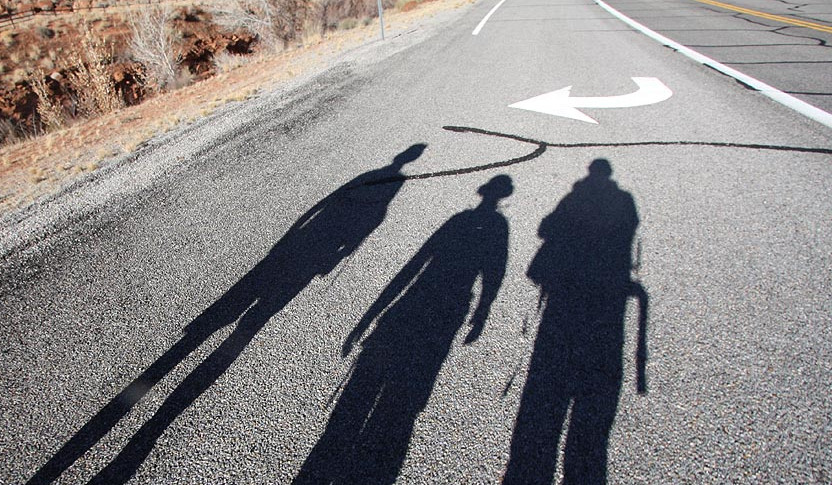
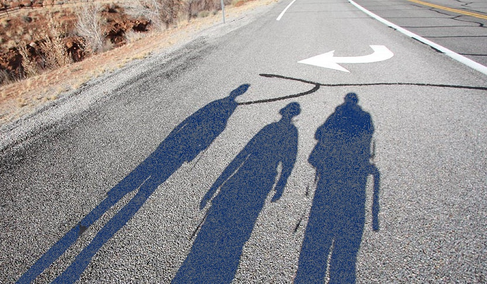
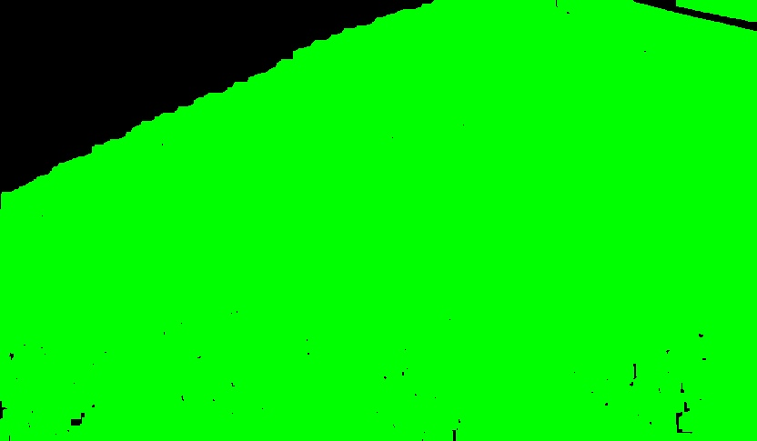
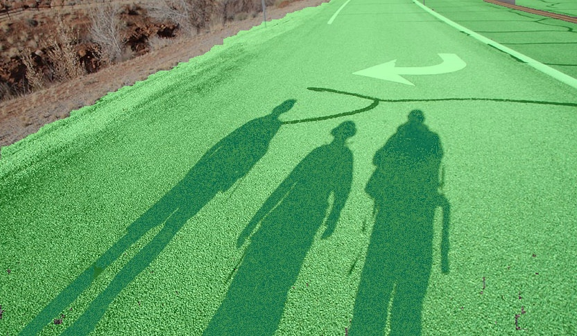

# Autonomous Vehicle Project in EC5804 coursework

Proyecto colaborativo para la materia de Procesamiento Digital de Imagenes. 
Prof: Gerardo Fernández
Enero Marzo 2017.

Implementación de paper: 
"Enhancement Performance of Road Recognition System of Autonomous Robots in Shadow Scenarios"
Olusanya Y. Agunbiade, Tranos Zuva, Awosejo O. Johnson and Keneilwe Zuva

## Results
### Entry image:

### After shadow compensation:

### Road mask after shadow classification:

### Original image after road classification algortihm:

